# Jump Journey

Set in a pretty landscape, the player must strategically jump over obstacles to reach the next high score.

Deployed link to the website: https://tekali7.github.io/JumpJourney/

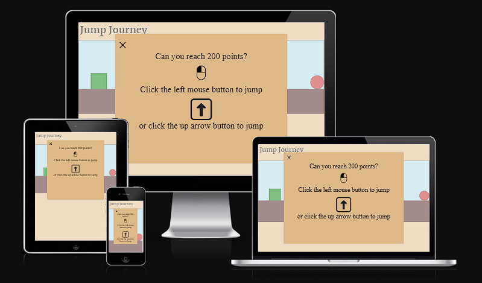

# Purpose of this project

A website here to provide entertainment to the user in the form of a fast paced jumping game.
The user controls a character which can be controlled using either the left mouse button or the up arrow key.

# Table of contents:

* [User Demographic](https://github.com/Tekali7/JumpJourney#user-demographic)

* [User Experience](https://github.com/Tekali7/JumpJourney#user-experience)
    * [User stories](https://github.com/Tekali7/JumpJourney#user-stories)
        * [Visitor Goals](https://github.com/Tekali7/JumpJourney#visitor-goals)

* [Features](https://github.com/Tekali7/JumpJourney#features)
    * [Header/Navigation](https://github.com/Tekali7/JumpJourney#headernavigation)
    * [User-Friendly Interface](https://github.com/Tekali7/JumpJourney#user-friendly-interface)
    * [Sound effects](https://github.com/Tekali7/JumpJourney#sound-effects)
    * [Score Counter](https://github.com/Tekali7/JumpJourney#score-counter)
    * [Game over SweetAlert](https://github.com/Tekali7/JumpJourney#game-over-sweetalert)
    * [Instructions Modal](https://github.com/Tekali7/JumpJourney#instructions-modal)
    * [Collision Detection](https://github.com/Tekali7/JumpJourney#collision-detection)
    * [Future implementations](https://github.com/Tekali7/JumpJourney#future-implementations)

* [Technology](https://github.com/Tekali7/JumpJourney#technology)
    * [Languages](https://github.com/Tekali7/JumpJourney#languages)
    * [Frameworks, Libraries and Programs](https://github.com/Tekali7/JumpJourney#frameworks-libraries-and-programs)

* [Design](https://github.com/Tekali7/JumpJourney#design)
    * [Typography](https://github.com/Tekali7/JumpJourney#typography)
    * [Color scheme](https://github.com/Tekali7/JumpJourney#color-scheme)
    * [Wireframes](https://github.com/Tekali7/JumpJourney#wireframes)

* [Testing](https://github.com/Tekali7/JumpJourney#testing)
    * [Validator Testing](https://github.com/Tekali7/JumpJourney#validator-testing)
        * [W3C HTML Validator](https://github.com/Tekali7/JumpJourney#html-validator)
        * [W3C CSS Validator](https://github.com/Tekali7/JumpJourney#css-validator)
        * [JSHint](https://github.com/Tekali7/JumpJourney#jshint)
    * [Lighthouse Testing](https://github.com/Tekali7/JumpJourney#lighthouse-testing)
    * [Manual Testing](https://github.com/Tekali7/JumpJourney#manual-testing)
        * [Features Testing](https://github.com/Tekali7/JumpJourney#features-testing)
        * [Device Testing](https://github.com/Tekali7/JumpJourney#device-testing)
        * [Browser Compatibility](https://github.com/Tekali7/JumpJourney#browser-compatibility)
    * [Fixed Bugs](https://github.com/Tekali7/JumpJourney#fixed-bugs)
    * [Known Bugs](https://github.com/Tekali7/JumpJourney#known-bugs)

* [Deployment](https://github.com/Tekali7/JumpJourney#deployment)
    * [How to Deploy](https://github.com/Tekali7/JumpJourney#how-to-deploy)
    * [How to Fork](https://github.com/Tekali7/JumpJourney#how-to-fork)
    * [How to Clone](https://github.com/Tekali7/JumpJourney#how-to-clone)

* [Credits](https://github.com/Tekali7/JumpJourney#credits)
    * [Code](https://github.com/Tekali7/JumpJourney#code)
    * [Media](https://github.com/Tekali7/JumpJourney#media)

* [Acknowledgments](https://github.com/Tekali7/JumpJourney#acknowledgments)

# User Demographic

The game is targeted to a broad audience. Particularly those who enjoy casual and accessible web-based games. With its easy and straightforward controls the game can be played by almost any age group. Also people that are new to gaming have it easy to start with a casual game like JumpJourney.

# User Experience

## User stories

### Visitor goals

- As a visitor, I want to easily understand the main purpose of the website.

- As a visitor, I want to quickly understand the objective of the game.

- As a visitor, I want to be instructed of the controls.

- As a visitor, I want to be able to use more than just one button to control the player.

- As a visitor, I want to see the highest score I managed to get.

# Features

The website consists of one page with numerous features which offer the user a pleasant website experience.

## Header/Navigation

The title of the game is a link that leads back to the start of the page. When clicked, the user can restart the game and refresh their memory of the instructions.

## User-Friendly Interface

The interface of the website is very user-friendly and is designed to provide easy navigation and gameplay. For example: The user can click anywhere on the screen to let the player jump.
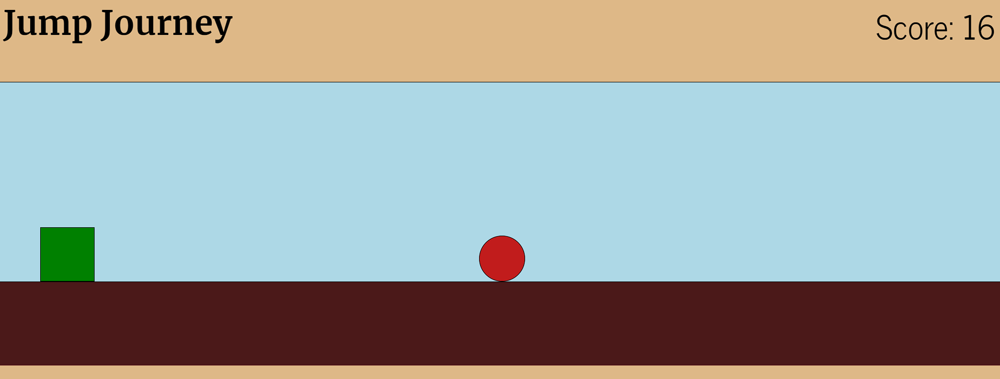

## Sound effects

The game provides the player with acoustic feedback when jumping or colliding with the obstacle. This additional feedback increases the experience of the user on the website, as it increases the immersion of the game.
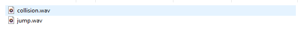

## Score Counter

The score counter captures the current score that the user managed to play. This encourages the user to replay the game to try and break their recent high-score.
 

## Game over SweetAlert

The game over SweetAlert function tells the user that the gaming session has ended. Informing them that they collided with the obstacle, thus ending the game. It displays the highest score that the user reached, as well as a "Try Again" button which gives the user the choice to refresh and replay the game.
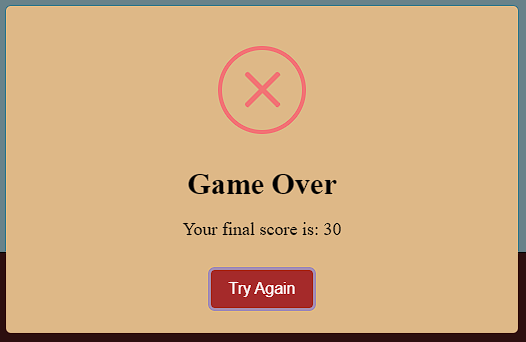

## Instructions Modal

The instructions modal informs the user about the possible ways to control the player, while holding the game on pause. It displays two images with short descriptions underneath each image. The first image displays a left mouse button and the second image displays a arrow up button.
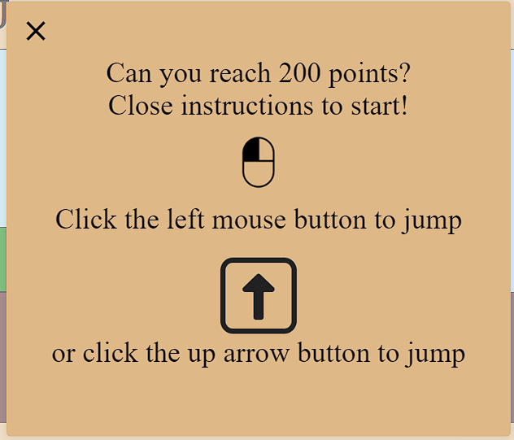

## Collision Detection

The game checks if the player has collided with an obstacle every 10ms. If a collision occurs the game ends and the score stops counting.
 
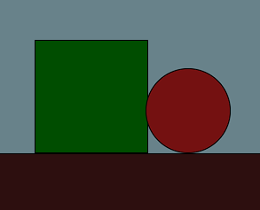

## Future implementations

Future implementations for this website are.

- A pause function to stop the game mid-run.

- Different difficulty setting, from easy to hard.

- Storage of the highest scores, similar to a Top 10 list.

- Online leaderboard to let the user compare themselves to the world.

# Technology

## Languages

- HTML5
- CSS3
- JavaScript

## Frameworks, Libraries and Programs

- IDE: [Visual Studio Code](<https://code.visualstudio.com/>)
- Version Control: [Git](<https://gitforwindows.org/>)
- Repository: [GitHub](<https://github.com/Tekali7/JumpJourney>)
- Image converter: [Convertio](<https://convertio.co/de/jpg-webp/>)
- Image compression: [Tinypng](<https://tinypng.com/>)
- Favicon generator: [Favicon](<https://favicon.io/>)
- Wireframe: [Balsamiq](<https://balsamiq.com/>)
- Alert: [SweetAlert2](https://sweetalert2.github.io/)

# Design

## Typography

The typography was chosen because it gives the user nice and clean feedback (e.g. score), without distracting them from the actual gameplay.
The fonts Merriweather and News Cycle from [Google fonts](<https://fonts.google.com/>) have been applied to this website.

## Color scheme

The color scheme was chosen to represent a landscape which the player travels through. The brown color under the player stands for the ground and the lightblue color in the background represents the sky. The WCAG color contrast checker extension for Chrome was used to determine fitting colors.

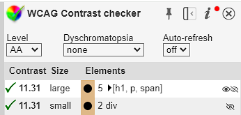

## Wireframes

- Instructions Modal Wireframe
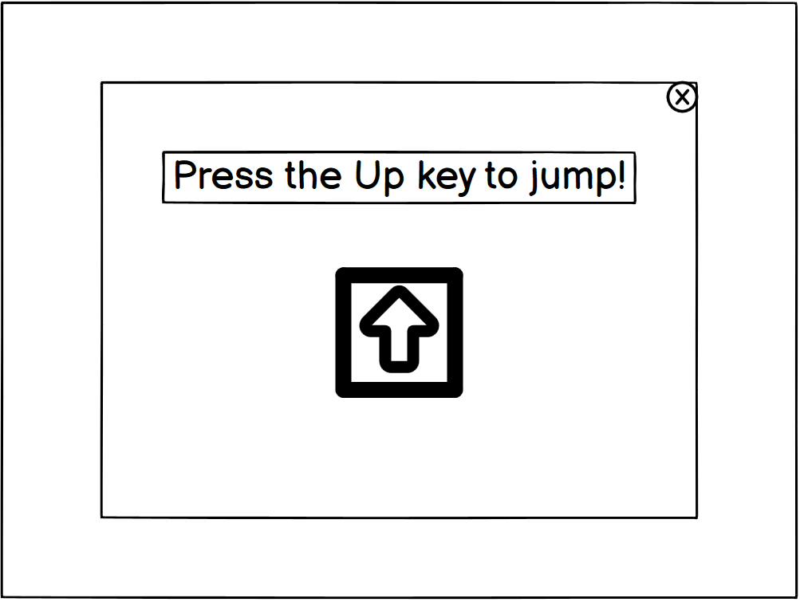

- Game Wireframe
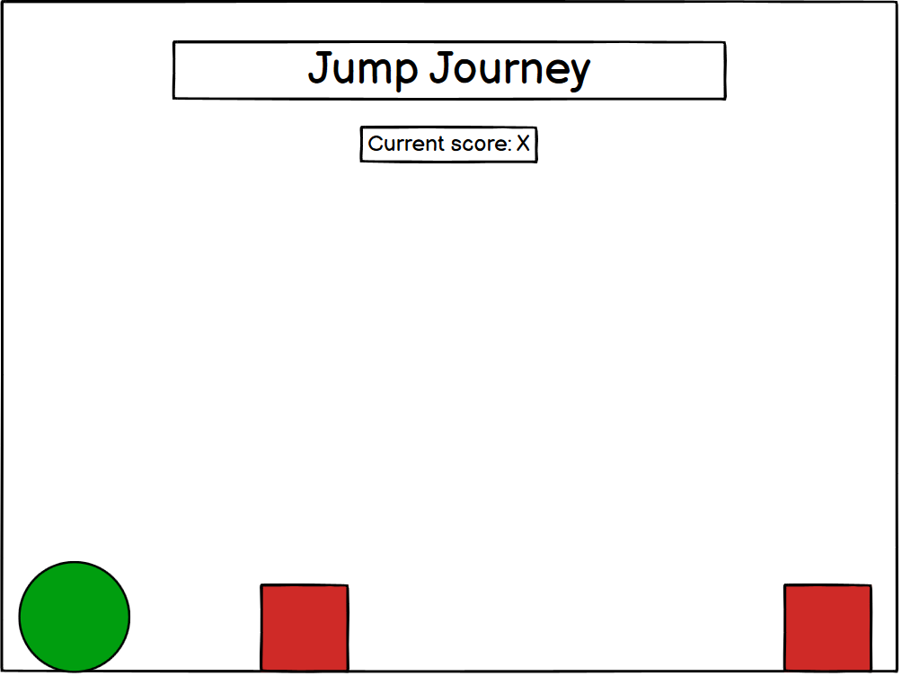

- Game over Wireframe
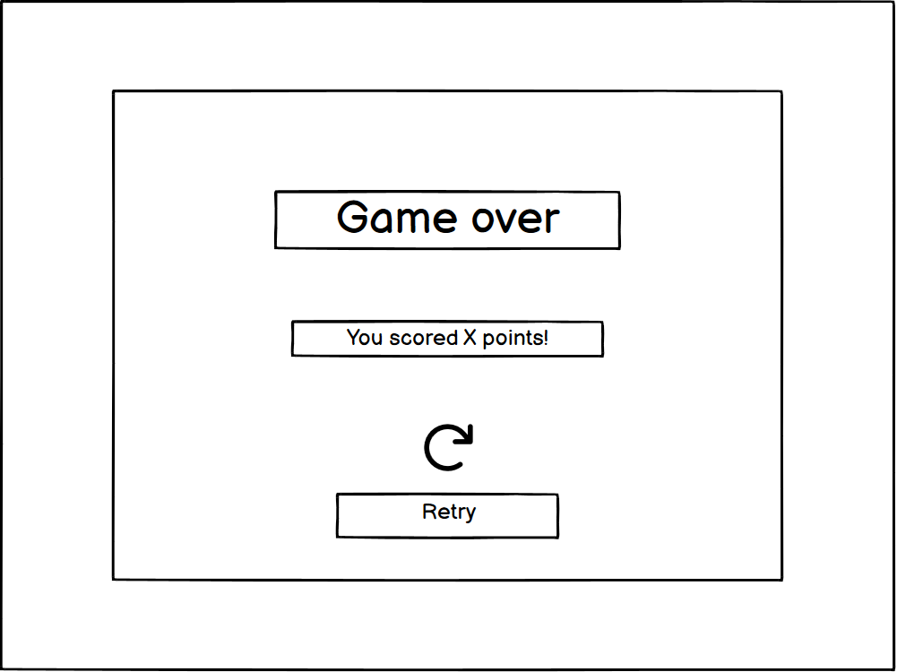

# Testing

## Validator Testing

The [W3C Markup Validator](https://validator.w3.org/), [W3C CSS Validator](https://jigsaw.w3.org/css-validator/) and [JSHint](https://jshint.com/) were used to validate the project.
The validation results are displayed with a snippet of the code to indicate their association with the respective page.

### HTML Validator

- Validator result for index.html
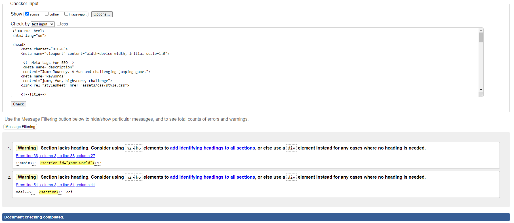

### CSS Validator

- Validator result for style.css
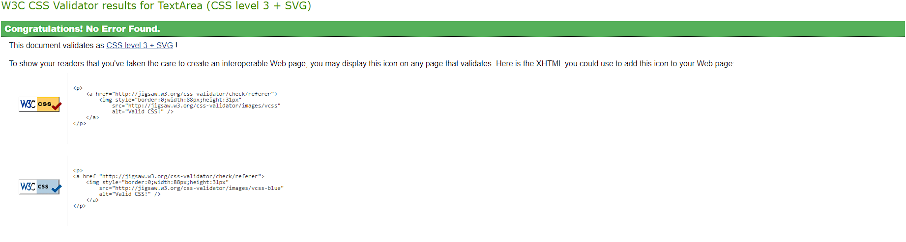

- Validator warning

This warning is due to the import of the Google fonts.
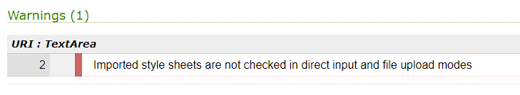

### JSHint

- Validator result for script.js
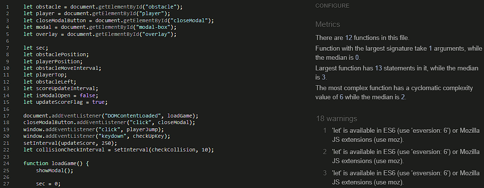
JSHint outputs 18 warnings which are considered aceptable. They are:
1. 	'let' is available in ES6 (use 'esversion: 6') or Mozilla JS extensions (use moz).

and
 

2.  'arrow function syntax (=>)' is only available in ES6 (use 'esversion: 6').

## Lighthouse Testing

The website was tested using Lighthouse in Chrome DevTools throughout the development to check performance, accessibility, best practices and SEO. The final test on Lighthouse was run on incognito mode.

- Lighthouse result for index.html
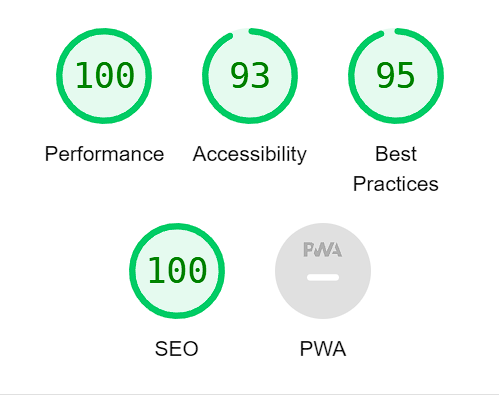

## Manual Testing

### Features Testing

#### Header/Navigation

| Test Label | Test Action           | Expected Outcome | Test Outcome |
| ---------- | --------------------- | ---------------- | ------------ |
| Header     | Click on Header Title | Open Home page   | PASS         |

#### Insctructions modal

| Test Label | Test Action           | Expected Outcome | Test Outcome |
| ---------- | --------------------- | ---------------- | ------------ |
| Instructions modal| Close the modal | Game and score start running   | PASS         |

#### Score counter

| Test Label | Test Action           | Expected Outcome | Test Outcome |
| ---------- | --------------------- | ---------------- | ------------ |
| Score counter| Run game | Count up score  | PASS              |   

#### Collision detection

| Test Label | Test Action           | Expected Outcome | Test Outcome |
| ---------- | --------------------- | ---------------- | ------------ |
| Collision detection | Collide with obstacle | Game and score stop  | PASS         |

#### Game over SweetAlert

| Test Label | Test Action           | Expected Outcome | Test Outcome |
| ---------- | --------------------- | ---------------- | ------------ |
| Game over  | Collide with obstacle | Game over SweetAlert displays   | PASS         |

#### Sound effects

| Test Label | Test Action           | Expected Outcome | Test Outcome |
| ---------- | --------------------- | ---------------- | ------------ |
| Sound effects  | Jump/ Collide | Sound for jump/collision plays   | PASS         |

### Device Testing

Functionality, layout, and responsiveness were tested on the following devices and screens with issues in the collision detection:
This game was optimized for 1920px x 1080px screens.

- Lenovo Monitor 2560px x 1440px
- Samsung Monitor 1920px x 1080px
- Samsung Galaxy S9 1440px x 2960px
- iPhone 11 1792px x 828px

### Browser Compatibility

Testing has been carried out on the following browsers:
- Chrome Version 118.0.5993.117/118
- Safari Version 17.1
- Edge Version 118.0.2088.76
- Firefox Version 119.0

## Fixed Bugs

* Bug: Score on screen and score on SweetAlert show different numbers (SweetAlert score is 1 higher)

* Tried solutions:
1. Use ++sec instead of sec++
2. ClearInterval of the setInterval for the updateScore function
3. Updating the score again after clearing the intervals by getting the score from the dom

* Working solution: Decrement the value of "sec" by 1 with --sec

## Known Bugs

* The player sometimes collides with the obstacle without touching it.
Therefore leading to the player being either stuck in the "air" or getting back to the ground infront of the obstacle and triggering a game over.

# Deployment

## How to Deploy

Website deployment is the process of making a website live and accessible on the internet for people to visit.

1. Log into GitHub.
2. Locate repository (left-side or top-right icon and then on "Your repositories").
3. Select repository and navigate to "Settings" on the horizontal bar.
4. Open the "Pages" menu and select "main" for the branch.
5. The page will refresh with a link to the deployed website.
6. It may not go live for a few minutes, refresh the page to update the link.
7. Once deployed, the live website will automatically update when any changes are pushed to the main branch.

## How to Fork

Forking allows you to create a copy of the original repository in your own GitHub account. This enables you to make changes to the code without affecting the original code.

1. Log into GitHub.
2. Locate repository and select the repository.
3. Select the "Fork" button near the top-right.
4. You should now have a new copy of the original repository in your own GitHub account.

## How to Clone

Cloning allows you to make an exact copy of a code repository, usually for collaboration or to work on different features independently.

1. Log into GitHub.
2. Locate repository and select the repository.
3. Click the green "<> Code" button.
4. If you want to clone using HTTPS, select the copy button in the HTTPS menu.
5. Open Git Bash.
6. Change the current working directory to the location where you want your cloned directory to be.
7. Type "git clone", and then paste the URL you copied earlier and press "Enter".

# Credits

## Code

- The code for the "DOMContentLoaded" eventlistener was learned from the walkthrough project [Love Maths](https://learn.codeinstitute.net/courses/course-v1:CodeInstitute+LM101+2021_T1/courseware/2d651bf3f23e48aeb9b9218871912b2e/234519d86b76411aa181e76a55dabe70/)

- The markdown tables were generated with the help of [Tabletomarkdown](<https://tabletomarkdown.com/convert-spreadsheet-to-markdown>)

- Code for the game idea in general were from [KnifeCircus](https://www.youtube.com/watch?v=bG2BmmYr9NQ)

- Some of the code for the obstacle movement was learned from [java2s](http://www.java2s.com/ref/javascript/javascript-setinterval-move-element.html)

- The code for the instructions modal was learned from [w3schools](https://www.w3schools.com/howto/howto_css_modals.asp)

- The code for the SweetAlert was adapted from [ChatGPT](https://chat.openai.com/)

## Media

- The left mouseclick and up arrow button image were found on [thenounproject](https://thenounproject.com/)

- The jump and collision sounds were found on [mixkit](https://mixkit.co/free-sound-effects/)

# Acknowledgments

- Many thanks to Brian Macharia for always finding time for me and this project. And for the good feedback on how to improve my website as well as providing me with resources and websites to help with coding and testing.

- Many thanks to David Calikes for always being available for when I have a question about my code or the project itself. And also for giving me inspiration and ideas to implement into the project.